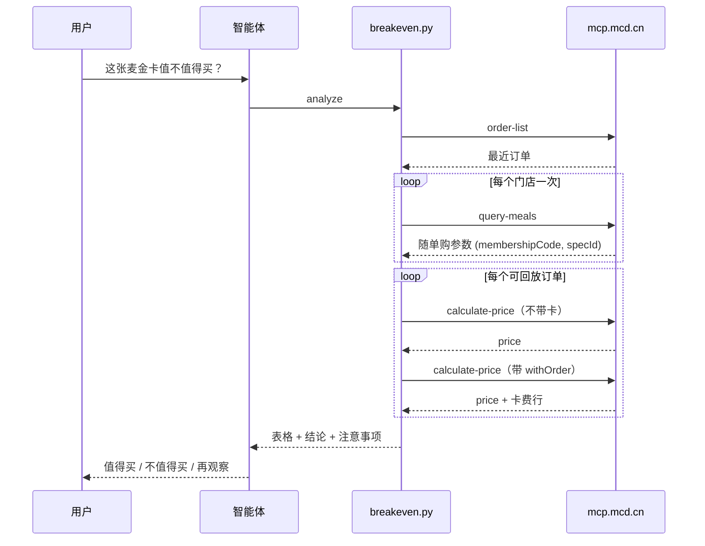

# MCP 集成说明

## 使用的 MCP 服务

- 服务：麦当劳中国 MCP Server，`https://mcp.mcd.cn`（Streamable HTTP，纯 JSON，无 session id）
- 鉴权：`Authorization: Bearer <token>`，Token 仅从环境变量 `MCD_MCP_TOKEN` 读取
- 请求头：`Content-Type: application/json`、`Accept: application/json, text/event-stream`
- 限流：600 次/分钟，超限返回 429；401 表示 Token 无效
- 官方文档：<https://open.mcd.cn/mcp>

CLI 直接以 HTTP 调用 MCP（标准库 urllib）。`mcp-config.example.json` 仅供在支持 MCP 的智能体客户端里配置同一服务时参考。

## 用到的 Tools

| Tool | 用途 |
|---|---|
| `order-list` | 读取最近约 10 单历史订单 |
| `query-meals` | 每个门店查询一次，运行时发现随单购麦金卡的 `membershipCode` / `specId` |
| `calculate-price` | 每单调用两次：不带卡、带卡，得到官方计算的价格 |
| `now-time-info` | `check` 子命令的连通性检查 |

## 只读白名单

代码中硬编码白名单，请求其他工具会在发起网络请求前直接抛出 `ForbiddenToolError`：

`order-list`、`query-meals`、`query-meal-detail`、`calculate-price`、`query-nearby-stores`、`query-my-account`、`now-time-info`

明确**永不调用**：`create-order`、`cancel-order`、`mall-create-order`、`draw-lottery`、`party-order-create`、`auto-bind-coupons`、`delivery-create-address`。

## 调用流程



响应的 `result.content[0].text` 是 Markdown 前言 + `## Original Response` + 一个 JSON 对象：先定位该标题，再取其后第一个 `{`，用 `json.JSONDecoder().raw_decode` 解析。

## 字段映射

| order-list 字段 | calculate-price 参数 |
|---|---|
| `storeCode` | `storeCode` |
| `orderType` | `orderType` |
| `beType` | `beType` |
| `beCode`（有则传，如得来速） | `beCode` |
| `orderProductList[].productCode` / `quantity` | `items[].productCode` / `quantity` |
| query-meals `withOrder.membershipCode` | `withOrder.membershipCode` |
| query-meals `withOrder.specId` | `withOrder.membershipSpecId`（**注意名称不同**） |

只回放 `orderType = "1"` 且 `beType` 为 1（到店）或 5（得来速）的订单；麦乐送（`orderType = "2"`）会被跳过并说明原因。找不到随单购参数时回退到 106/870 并给出警告。

## 卡费推导

所有金额单位为分。带卡结果的 `productList` 会多出一行不在请求商品里的卡费行（如 `麦金卡月卡（30天）`）：

```
card_fee         = 该行 subtotal
单次节省         = price_without_card − (price_with_card − card_fee)
```

示例（接口验证值）：不带卡 8813，带卡 6890（含卡费 1900）→ 节省 = 8813 − (6890 − 1900) = 3823 分 = ¥38.23。卡费在汇总时只扣一次。

响应里的 `enjoyable` / `enjoyed` 在 `--json` 中原样输出（`balance` 含义未公开，不做解读）。其中不带卡响应的 `data.enjoyed`（含 `promotionName`、`realDiscount`）表示账号已享受的身份/会员折扣（如员工卡 7.5 折）：带 `withOrder` 时，随单购麦金卡的优惠会**替换**它而不是叠加，所以带卡价可能高于基准价。检测到时工具记录每单的 `promotionName` / `realDiscount`，置 `baseline_has_identity_discount`，并给出结论“无法判断（已有身份折扣）”。卡费不假定固定值，每次取自带卡结果中不属于所请求商品的那一行（实测不同账号可能不同）。

## 限流处理

- 调用之间短暂停顿（约 0.15 秒）
- 遇到 429 指数退避重试（1s、2s、4s），最多 3 次，仍失败则友好报错
- 一次分析的调用量约 `1 + 门店数 + 2 × 订单数`，远低于 600 次/分钟

## 业务价值

用用户自己的真实习惯，把“要不要买卡”变成可核对的数字：回本需要每 30 天多少单、预计节省多少，不划算就明确说别买。
